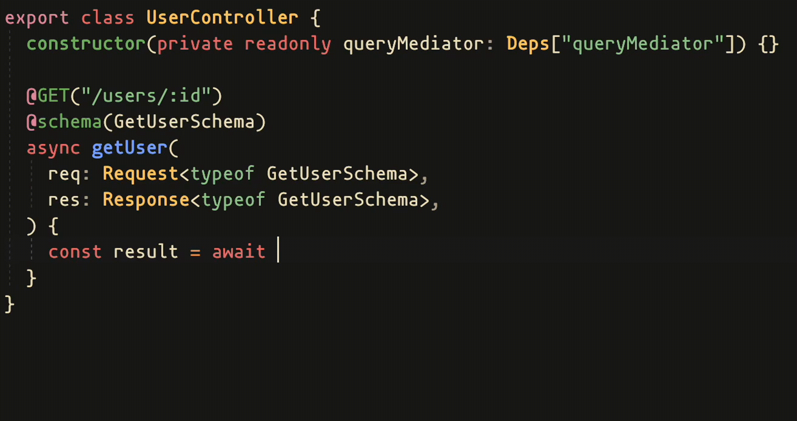

# CQRS Quick Start

awilixify encourages and provides utilities for implementing the CQRS (Command Query Responsibility Segregation) pattern with type-safe query and command handlers.

### Defining Handlers

Create handlers that implement the `Handler<QueryContract<...>>` interface with a unique static key and executor function:

```typescript
import { type Handler, type QueryContract } from "awilixify";
import type { UserModuleDeps } from "./user.module";

// Define payload and response types
type Payload = { userId: string };
type Response = { id: string; role: "admin" | "user" };

export class GetUserQueryHandler implements Handler<
  GetUserQueryHandler["contract"]
> {
  static readonly key = "users/get-user";
  declare readonly contract: QueryContract<
    typeof GetUserQueryHandler.key,
    Payload,
    Response
  >;

  constructor(private readonly userService: UserModuleDeps["userService"]) {}

  async executor(payload: Payload): Promise<Response> {
    return this.userService.findById(payload.userId);
  }
}
```

### Registering Handlers in Modules

Add query handlers to the module's `queryHandlers` array. Include them in the `ModuleDef` type for full mediator type safety:

```typescript
import { createModule, type ModuleDef } from "awilixify";

type UserModuleDef = ModuleDef<{
  providers: {
    userService: UserService;
  };
  queryHandlers: [typeof GetUserQueryHandler];
}>;

export type Deps = UserModuleDef["deps"];

export const UserModule = createModule<UserModuleDef>({
  name: "UserModule",
  providers: {
    userService: UserService,
  },
  queryHandlers: [GetUserQueryHandler],
});
```

### Executing Queries

Execute queries from controllers using query mediator:


