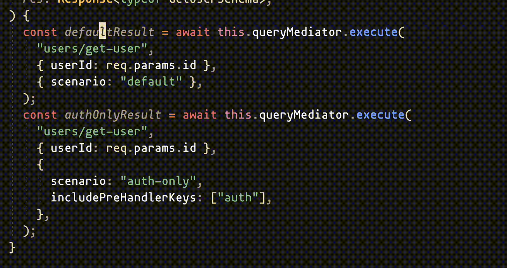

# Scenarios

Scenarios provide explicit, per-call control over which pre-handlers execute.
Both handler `context` and `execute(...)` return type are recalculated per scenario.

### Why it exists

Scenarios were introduced to control pre-handler execution explicitly per call while preserving full type safety. Instead of method-level guard decorators (as in Nest), scenario configuration is declared and type-checked, so execution rules are visible in code and changes trigger compile-time feedback.

- `includePreHandlerKeys`: pick exact pre-handlers for this scenario
- `excludePreHandlerKeys`: remove specific pre-handlers from default/full set
- caller must pass `scenario` and its required settings

```typescript
import { Result, type QueryContract } from "awilix-modular";

class HandlerError extends Error {}

type Response = Result<{ id: string }, HandlerError>;

// Assume:
// - auth pre-handler adds { userId: string } and can return UnauthorizedError
// - tenant pre-handler adds { tenantId: string } and can return TenantNotFoundError
class GetUserHandler {
  static readonly key = "users/get-user";
  declare readonly contract: QueryContract<
    typeof GetUserHandler.key,
    { userId: string },
    Response,
    { name: "default" } | { name: "auth-only"; includePreHandlerKeys: ["auth"] }
  >;

  async executor(
    payload: { userId: string },
    // { userId: string } | { userId: string; tenantId: string }
    context: this["contract"]["context"],
  ): Promise<Response> {
    if ("tenantId" in context) {
      console.log(context.tenantId);
    }

    if (!payload.userId) {
      return Result.error(new HandlerError("Missing userId"));
    }

    return Result.ok({ id: payload.userId });
  }
}
```

### Executing scenarios in action


